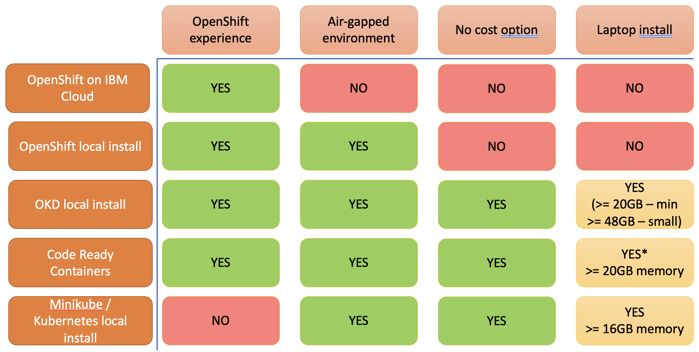

# Where to run the Cloud Native Toolkit

The Cloud Native Toolkit is made up of Open Source projects with some helper functions and installation utilities added by the Cloud Native Toolkit project.  It has been designed to run on a Kubernetes cluster.  Either a generic Kubernetes cluster or an Open Shift cluster.  The IBM Cloud is the default installation target.

This project extends the core Cloud Native Toolkit to allow installation on a local laptop or workstation:

## Learning environment

The IBM Cloud managed Open Shift environment is ideal for production use, to support active development teams to develop new applications and services.  It can also be used to host learning environments for developers wanting to learn Enterprise Cloud Native development skills.  However, there are times when using the Managed OpenShift environment on IBM Cloud may not be ideal, so the chart below shows other options for installing the toolkit.

### OpenShift Experience

OpenShift builds on top of Kubernetes to offer an integrated cloud platform.  

There are a specific set of features built into OpenShift for developers, including the Developer perspective, integrated operator hub and private image registry along with the catalog of services and integrated DevOps tooling.

### Air gapped environment

Sometimes it is desirable to run disconnected, or where external internet access may not be available, so having the ability to run in an air gapped way allows developers to access the training environment when a cloud hosted environment isn't possible.

### No Cost option

Running on a public cloud does incur expense, however, the cost of having to manually install, configure and maintain an environment should not be overlooked when looking at total cost of an environment.  However, sometimes a developer wants to create their own private sandbox environment to facilitate deeper learning, needing access permissions to the environment which may not otherwise be available

### Laptop install

This is where an isolated environment is needed, either for a personal environment or where there are restrictions in place for internet access.  

The key issue with local installs is the resources needed to run an environment.  An Enterprise Cloud Native Development environment is designed to be hosted on a cloud, where resources are readily available to support the needs of developers.  This scale of resource is not available on a typical developer laptop or workstation.

It is possible to run the cloud native toolkit on a laptop and work through the training material and the chart above shows the options available.

- [OKD](https://okd.io) is the upstream, open source version of OpenShift.  It can be run on a number of platforms, including a cut down single host option and a version of [Code Ready Containers](https://www.okd.io/crc.html) available on OKD, which is a cut-down, single host install.
- [Code Ready Containers (CRC)](https://developers.redhat.com/products/codeready-containers/overview) is a version of OpenShift that is specifically intended to allow developers to have access to a local Open Shift environment.  It is bundled as a single virtual machine that runs on the developer laptop and it can run on a 16GB machine, but once additional development tooling is installed and developer activity starts within the CRC environment you quickly run into resource issues, so additional memory is recommended.

  !!!Warning
      There is currently an issue with the disk resize option on MacOS.  The default disk size is sufficient to run OpenShift, but not sufficient to install additional tooling and perform development work within the Open Shift environment.
- [Minikube](https://minikube.sigs.k8s.io/docs/) provides a single node, standard Kubernetes installation using minimal system resources, so is ideal for a local kubernetes environment on a laptop.  This project extends the [Cloud Native Toolkit](https://cloudnativetoolkit.dev) project to support Minikube as a target install environment.  The downside to Minikube is that is is a base Kubernetes install, so the enhanced OpenShift environment is not available to developers, but all the Open Source tooling is still available and many of the integrated features available in OpenShift have an upstream open source project, such as Tekton is the base technology for OpenShift pipelines and Che/Theia is the base technology for Code Ready Workspaces.

There are also some additional considerations when looking at an Air Gapped or local laptop/workstation install, which are discussed [here](localCloudNativeToolkit.md)
